# dla niekumatych

w tym repo jest notatka z matmy z funkcji (matma liceum klasa 1) stworzona specjalnie dla mojego jakze kochanego przyjaciela artiego

obrazki NIE SĄ MOJE, autorzy zastrzegają sobie prawa do nich

notatka w wiekszosci pisana, część kopiowana z podrecznika, więc po prostu załóżmy że twórcy tego podrecznika zastrzegają sobie prawa do całej tej notatki (błagam nie chce do sądu)

notatka jest low-effort co można zobaczyć w wieeelu miejscach

pozdro lecimy

# Wprowadzenie

siema arti ogolnie wzialem podrecznik przelecialem wszystkie tematy i napisalem to najprosciej jak potrafie zeby latwo bylo zrozumiec xdddd

powodzenia na sprawdzianie i do dziela

# TEMAT 1 Funkcje i ich własności

## Definicja funkcji

Funkcja f ze zbioru X w zbiór Y (zbiory X i Y są niepuste) - każdemu elementowi ze zbioru X został przyporządkowany **tylko jeden** element ze zbioru Y. Funkcję tę oznaczamy f: X → Y.

Zbiór X -> **DZIEDZINA FUNKCJI**

Zbiór Y -> **PRZECIWDZIEDZINA FUNKCJI**

Elementy zbioru Y przypisane do elementów zbioru X -> **ZBIÓR WARTOŚCI FUNKCJI**

## Sposoby opisywania funkcji

- graf,

- opis słowny,

- tabelka,

- zbiór par uporządkowanych,

- wykres funkcji,

- wzór funkcji.

## Przykłady dla funkcji f(x) = x2, x ∈ {–1, 0, 1, 2}

### Graf

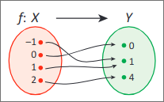

### Opis słowny

"Funkcja f każdej liczbie ze zbioru {–1, 0, 1, 2} przyporządkowuje jej kwadrat."

### Tabelka

| x    | -1  | 0   | 1   | 2   |
| ---- | --- | --- | --- | --- |
| f(x) | 1   | 0   | 1   | 4   |

### Zbiór par uporządkowanych

{(–1, 1), (0, 0), (1, 1), (2, 4)}

### Wykres

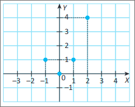

### Wzór

w podreczniku są podane 3 sposoby

f: x → x2, jeśli x ∈ {–1, 0, 1, 2}

f(x) = x2, jeśli x ∈ {–1, 0, 1, 2}

y = x2, jeśli x ∈ {–1, 0, 1, 2}

# TEMAT 2 Wykres funkcji

Wykres funkcji w skrócie: w poziomie masz x, w pionie y. 

Poniżej to **NIE SĄ** wykresy funkcji.

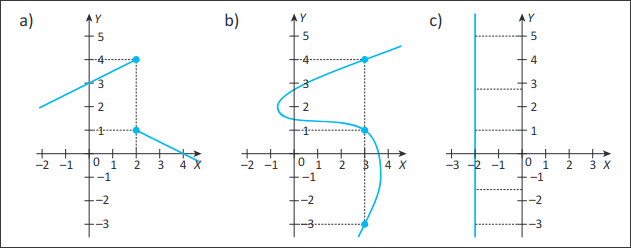

Dlaczego? Bo funkcja dla każdego elementu w zbiorze X przyjmuje **TYLKO JEDEN** element ze zbioru Y, a tu tak nie jest

Poniżej to **SĄ** wykresy funkcji.

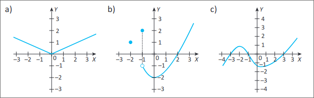

Dlaczego? Bo dla każdego punktu w X jest max 1 element w zbiorze Y (czasem 0) bla bla bla komu to potrzebne 😭

Poniżej wykres funkcji y = x, gdzie x ∈ ***R***

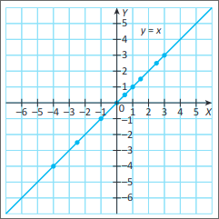

Dla każdego punktu na osi OX przypisany jest punkt z osi OY o tej samej liczbie (1->1, 2->2 itp itd)

Poniżej wykres funkcji y x= , gdzie x ∈ 〈0, +∞) <-> ten zbiór jest dlatego, że z ujemnej liczby pierwiastka nie zrobisz

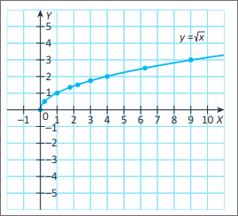

1 to 1, 2 to $\sqrt{2}$ , 3 to $\sqrt{3}$, 4 to 2 (bo $2=\sqrt{4}$)

# TEMAT 3 Dziedzina funkcji liczbowej

Ważną umiejętnością jest wyznaczanie dziedziny funkcji zarówno na podstawie wykresu funkcji, jak też z jej wzoru (tak pan jezus powiedzial)

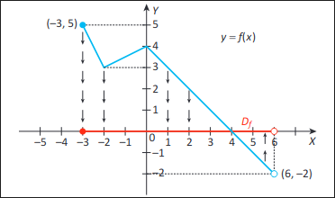

Tu z wykresu odczytujemy, że funkcja "zaczyna się" przy x=-3 (pełna kropka = włączając w to 3) a kończy na x=6 (pusta kropka = dąży do 6, ale wyłączając 6)

Czyli dziedzina D f = 〈–3, 6)

## Czym wgl jest dziedzina 

Dziedzina to zbiór wszystkich liczb rzeczywistych (x) dla których możemy obliczyć wartość/wynik funkcji (y)

A i jeszcze odczytajmy dziedzinę ze wzoru funkcji, to trzymaj dwa pro tipy

1) Pierwiastki stopnia parzystego (czyli pierwiastek drugiego,czwartego,szostego stopnia dla przykladu) można obliczać tylko z liczb nieujemnych (czyli dodatnich albo zera). Jeśli masz pierwiastek stopnia nieparzystego (np   $\sqrt[3]{-8}$ ) to nie dotyczy

2) Mianownik ułamka musi być zawsze liczbą różną od 0 bo przez zero nie podzielisz cholero

  $$f(x) = \frac{x}{\sqrt{x+6}}  $$

z pro tipa nr 2 wiemy że nie możesz dzielić przez 0, czyli   $\sqrt{x+6} \neq 0$ co sprowadza sie do   $x+6 \neq 0$ 

z protipa nr 1 wiemy że pod pierwiastkiem moze byc 0 lub wiecej a wiec   $x+6 \ge 0$

połącz oba i wychodzi ci że $x+6>0 \rightarrow x>-6$

# TEMAT 4 Zbiór wartości funkcji liczbowej. Najmniejsza i największa wartość funkcji

Zbiór wartości to wszystkie wyniki funkcji dla kazdego mozliwego x w dziedzinie

dalej nie rozumiesz? trzymaj przyklad mordko

g(x) = |2x + 3|, gdzie x ∈ {–5, –4, –1, 0, 2}

Obliczamy wartości funkcji g dla kolejnych argumentów:

g(–5) = 7

g(–4) = 5

g(–1) = 1

g(0) = 3

g(2) = 7

nasze wyniki to 1 3 5 i 7

czyli ZWg = {1, 3, 5, 7}

ZWcoś oznaczamy zbiór wartości funkcji

czasami zbiór wartości jest nieskończony np jak masz funkcje y=x to masz nieskonczoność x-sów i nieskonczoność y-ków

oooooo tu masz łatwy przykład z wykresikiem

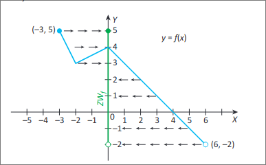

zbiór wartości zaczyna się w najniższym punkcie wykresu (najmniejszy y) w tym przypadku jest to -2 ale uwaga, kropka pusta w srodku, czyli dąży do -2 ale wyłączamy -2

jezeli jeszcze arti nie wiesz to to jest przedział niedomknięty tak zwany

zbiór wartości się kończy u góry tam po lewej na 5

jak widać wszystkie punkty osi OY w tym zakresie są również w pewnym momencie wartością funkcji

no to ZWf = (-2, 5〉

5 domkniete to ta strzałeczka, -2 niedomkniete to zwykly nawias zapamietaj to sobie 

w podreczniku definicja jest dłuuuuga:

Najmniejszą wartością funkcji liczbowej nazywamy najmniejszą z liczb należących do zbioru wartości funkcji, o ile w zbiorze wartości taka liczba istnieje.

Największą wartością funkcji liczbowej nazywamy największą z liczb należących do zbioru wartości funkcji, o ile w zbiorze wartości taka liczba istnieje.

BLA BLA BLA nie ma co to czytać moja lepsza

**najmniejsza** wartość funkcji liczbowej - bierzesz wszystkie wartości, wybierasz te najmniejszą i boom gotowe

**największa** wartość funkcji liczbowej - to samo, ale wybierasz te najmniejszą 😭

jeśli funkcja ma tylko jedną wartość to obie te tu tentegesy są takie same

dzieki cześć leci nastepny temacik

# TEMAT 5 Miejsce zerowe funkcji

Miejsca zerowe funkcji to takie x gdzie y=0

w sensie ze   $f(x)=0$

a i pamiętaj że miejsca zerowe na 100% są w dziedzinie funkcji

czaisz? git lecimy

a jak nie to przeczytaj jeszcze raz 

przykladzikkk

$f(x) = x^2 – 49$

chcemy znaleźć miejsca zerowe bez wykresu

czyli chcemy żeby   $x^2-49=0$

czyli chcemy żeby   $x^2 = 49$

a co do kwadratu daje 49? tak dokladnie jest to 7

czyli x=7

i nagle HOLA HOLA -7 do kwadratu to tez 49

dokladnie tak - już jedną jedynkę za to dostałem

wniosek - mamy dwa miejsca zerowe: x=7 lub x=-7

przykladzik numer DWA

  $f(x)=\sqrt{x+5}$

a więc dziedzina to bedzie wszystko co pod pierwiastkiem da nam zero lub więcej (pamiętasz pro tipy?)

kolejny pro tip dla ciebie przy okazji: zawsze obliczaj dziedzinę przed liczeniem miejsc zerowych żeby wykluczyć te co są poza dziedziną

w tym przypadku   $D_f = 〈–5, +∞)$

  $0=\sqrt{0}=\sqrt{x+5}=\sqrt{-5+5}\rightarrow x=-5$

dobra nastepny temat bo nigdy nie skoncze tej notatki

jak chcesz to porób zadanka mnie to nie interere

# TEMAT 6 Funkcje równe

Definicja z podręcznika:

- Funkcjami równymi nazywamy funkcje, które mają taką samą dziedzinę i dla każdego argumentu należącego do tej dziedziny wartości obu funkcji są równe.

FUJJJJ ale sie rozpisali nic nie rozumiem

wyjaśnie skrótowo

- funkcje równe to takie że dziedziny takie same, dla dowolnego x w obu funkcjach wyjdzie ci to samo. TYLE W TEMACIE

przykladzik tylko jeden teraz bo mnie juz plecy kurde bolą

zobaczymy czy   $f(x)=\frac{x^4+2x^2+1}{x^2+1}$ jest równa $g(x)=x^2+1$

dziedziny takie same bo   $x^2+1>0$ bo kwadrat na minusie kurde nie bedzie (nawet jakbys chcial!)

przekształcimy sobie wzór f(x) żeby go sprowadzić do jak najprostszej postaci

  $f(x)=\frac{x^4+2x^2+1}{x^2+1}$

chwila przecież   $x^4+2x^2+1$ to wzór skróconego mnożenia tu jest

no to   $f(x)=\frac{(x^2+1)^2}{x^2+1}$

a to się sprowadza do   $f(x)=x^2+1$

a wzór g(x) to to samo   $g(x) = x^2+1$

no to gg te same wzory to funkcje na 100% są równe 

pro tip, jeśli masz zadanie żeby udowodnić że funkcje nie są równe, wystarczy że znajdziesz co najmniej jednego x w którym y bedzie różne w obu funkcjach

plecy mnie boląąąą, następny temat (porób zadanka koniecznie!)

# TEMAT 7 Monotoniczność funkcji

monotoniczność goofy ahh zesty ahh

monotoniczność to takie pojecie że funkcja może w jakimś przedziale być rosnąca, malejąca, stała, nierosnąca i niemalejąca.

funkcja ... w przedziale A: znaczy że masz przedział A będący częścią przedziału X (czyli dziedziny funkcji). w tym przedziale A zachodzi zależność jedna z pięciu które wcześniej wymieniłem. zaraz ci pokaże wszystkie

- rosnąca w przedziale A: bierzesz dwa dowolne elementy tego przedziału. ten mniejszy element ma większą wartość, niż wartość tego większego elementu. nazwijmy te elementy a i b. Czyli   $a<b, f(a)<f(b)$

- malejąca w przedziale A:   $a<b, f(a)>f(b)$ czyli na wykresie lecimy w dóóóół jak wartość rubla w rosji...

- stała w przedziale A:   $a<b, f(a)=f(b)$ czyli masz na wykresie prostą krechę w tym przedziale nic sie nie zmienia

- nierosnąca: połączenie malejącej i stałej - czyli   $a<b, f(a)\ge f(b)$

- niemalejąca: połączenie rosnącej i stałej - czyli   $a<b,f(a) \le f(b)$

a i jeszcze jedno. jeśli przedział A obejmuje całą dziedzinę (np funkcja jest rosnąca w całej dziedzinie) to można powiedzieć że **funkcja jest** \<taka i taka\>, np. **rosnąca**.

funkcja f(x)=x jest rosnąca oraz niemalejąca - spełnia i ten i ten warunek

funkcja f(x)=3 jest stała,nierosnąca,niemalejąca - dla każdego x zawsze mamy 3 bo x nawet nie ma we wzorze funkcji xD

funkcja f(x) = -x jest malejąca oraz nierosnąca 

funkcja f(x) = x2 jest malejąca(i nierosnąca) w przedziale (-∞,0〉 i rosnąca(i niemalejąca) w przedziale 〈0,+∞)

porób se zadanka ja lece dalejjjj

# TEMAT 8 Funkcje różnowartościowe

funkcja różnowartościowa to taka że y sie nie powtarza w sensie że weźmiesz 2 dowolne x to na 100% nic się nie powtórzy

oczywiste więc że funkcja różnowartościowa jest albo rosnąca albo malejąca

proste nie?

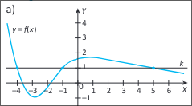

ta nie jest różnowartościowa, bo zobacz na prostą   $k  $. Przecina wykres w aż 3 punktach!!! Wniosek funkcja nie jest różnowartościowa bo wartość y=1 jest dla aż 3 x-sów {-4, -1, 5}

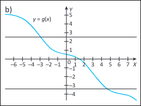

ta jest różnowartościowa - nic się nie powtarza funkcja jest malejąca (jak średnie zarobki w polsce) wszystko git ładnie

jeśli widzisz wzór funkcji, zastanów się, czy może się coś powtórzyć. jeśli dla przykładu masz   $x^2$, to jesteś w czarnej dupie bo minusowe do kwadratu to plusowe, i wtedy nie jest różnowartościowa

dzieki za uwage rób zadania

# TEMAT 9 Funkcje parzyste i funkcje nieparzyste

tego sam kiedyś nie rozumiałem więc postaram się wyjaśnić możliwie najprościej jak mogę

jeśli   $f(x)=f(-x)$ i -x też jest w dziedzinie, i jest to prawdziwe dla każdego możliwego x, to znaczy, że funkcja jest **parzysta**. 

Prosty sposób na sprawdzenie tego to popatrzenie na wykres i zobaczenie czy jest symetryczna wobec osi OY (czyli osi x=0)

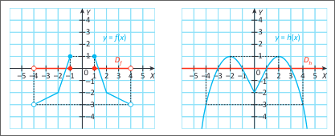

tu 2 przykłady

no i sigma

jeśli   $f(-x) = -f(x)$ i -x też jest w dziedzinie to znaczy że funkcja jest **nieparzysta**.

przy okazji, jeśli jest nieparzysta to   $f(0)=0$. **zawsze.**

Prosty sposób blablabla na wykresie symetryczna wobec punktu na środku

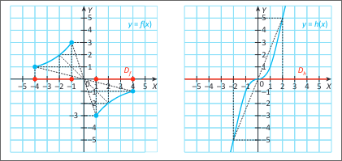

tu dwa przyklady

czaisz? to sigma lecimy z nastepnym tematem

jak chcesz to zrób jakies zadanka jak nie to nie

# TEMAT 10 Odczytywanie własności funkcji na podstawie jej wykresu. Szkicowanie wykresów funkcji o zadanych własnościach

ociechuj długa ta nazwa tematu

1. Jaka jest dziedzina funkcji?

2. Jaki jest zbiór wartości funkcji?

3. Czy funkcja ma miejsca zerowe? Jeśli tak, to jakie?

4. Dla jakich argumentów funkcja przyjmuje wartości dodatnie, a dla jakichujemne?

5. W jakich przedziałach funkcja jest rosnąca, w jakich malejąca, a w jakich stała?

6. Czy funkcja jest różnowartościowa?

7. Czy funkcja osiąga wartość największą, czy osiąga wartość najmniejszą? Jeśli tak, to dla jakiego argumentu?

na te pytania sobie odpowiadasz patrząc na wykres

nie ma co tu tłumaczyć, po prostu robisz wszystko to co robiliśmy do tej pory, ale patrząc na wykres to ustalasz

i tak wyjaśnie

1. dziedzine bierzemy patrząc jakie x mamy w wykresie

2. zbiór wartości bierzemy patrząc jakie y mamy w wykresie

3. miejsca zerowe to po prostu w jakim x sie przecina wykres z y=0

4. wartości dodatnie to po prostu y>0, wartości ujemne to y<0, bro to jest tak ez

5. patrzysz gdzie wykres jest rosnacy malejacy staly nierosnacy niemalejacy i tyle

6. jeśli nie jest ani rosnąca, ani malejąca (bez przerw), to nie jest różnowartościowa. w innym wypadku jest

7. najwyzszy i najnizszy y, patrzysz dla jakiego x i cyk gotowe (uwaga czasami może nie być najwyższego albo najniższego y, bo czasami mamy nieskonczony zbiór wartosci)

# TEMAT 11 Zastosowanie wiadomości o funkcjach do opisywania, interpretowania i przetwarzania informacji wyrażonych w postaci wykresu funkcji

ból w plecach jest już nie do zniesienia. minęły już ponad 2 godziny. ponad dwa tysiące słów. ALE CZEGO SIE NIE ROBI DLA ARTIEGO, LECIMY DALEJ RAHHHHH

tu przykładzik z porostami i stężeniem SO2 w powietrzu

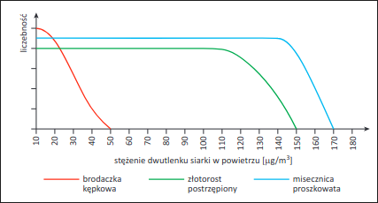

no i co widzisz? widzisz że przy 50 μg/m3 już brakuje jednego gatunku porostów.

takie zadanka bedziesz mial po prostu analizujesz wykres

tu kolejne zadanko. pan fizyk jedzie se skuterem 120 km potem sie przesiada na auto i tez 120 km. wykres zaleznosci drogi od czasu

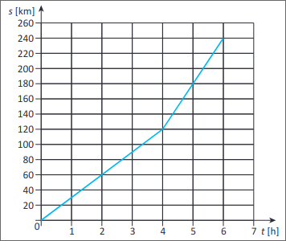

przykładowe pytania:

1. z jaką prędkością jechał skuterem

2. z jaką prędkością jechał autem

3. jaka była średnia prędkość na całej trasie 240 km

tego typu zadanka

# KONIEC - podsumowanie

palce mnie bolą nogi mnie bolą plecy mnie bolą dupa mnie boli

wiec mam nadzieje ze sie przyda

bo zajelo mi to 3h

licze ze zdasz sigma

